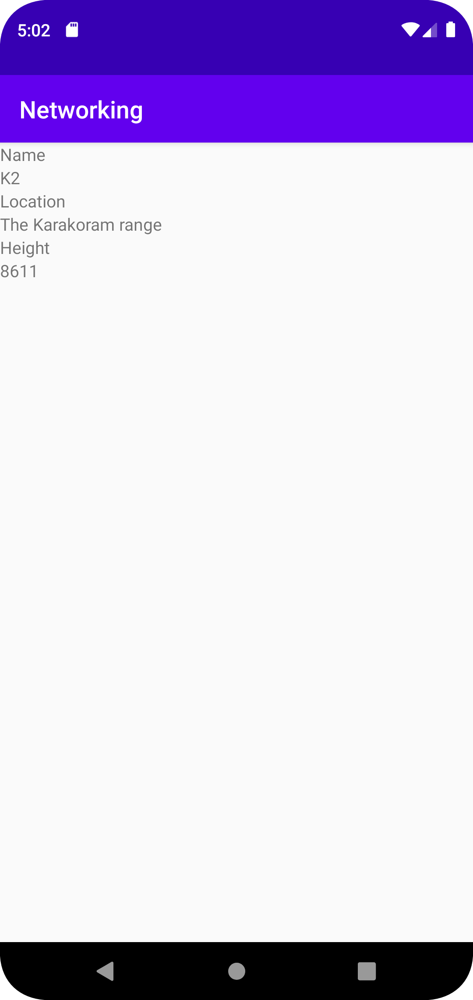
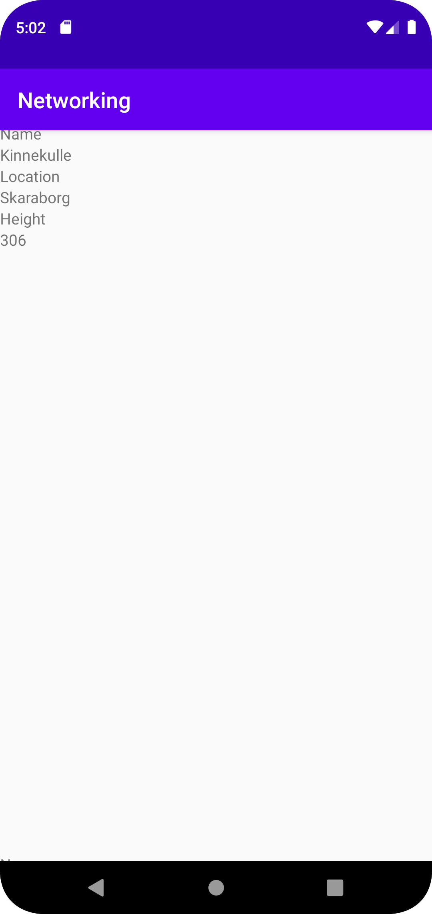
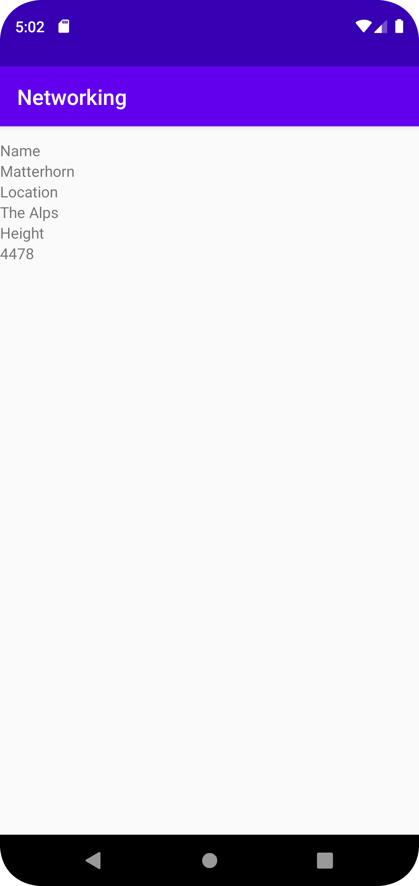

# Rapport

**Skriv din rapport här!**

För att skapa alla funktioner och array:er som kommer att behövas för att få ut datan så började jag med skapa samtliga klasser som behövdes samt raderade
de två klasserna som inte behövdes som fanns redan från forken.


I JsonTask klassen så behövdes ingen mer kod skrivas då en snäll lärare hade gett denna från start av forken.
/// JsonTask

///


I MainActivity så började jag med att skapa "private member variables" samt lägga till en implements till MainActivities "public class" för att den ska kunna läsa "JsonTask klassen". 
Därefter använder via våra "private member variables" till att skapa en länk mellan de olika xml-filerna samt klasserna så att vi kan skicka data mellan dessa. 
Här kommer variabeln adapter smidigt in som returnerar värden från klassen Viewholder. I klassen Main Activity har vi även en url som vi sedan kommer att hämta vår data ifrån.

Vid "onPostExecute" så parsar vi datan med gson. 
``` MainActivity
private ArrayList<Mountain> mountainList;
private RecyclerView recyclerView;
private SuperAdapter adapter;

private final String JSON_URL = "https://mobprog.webug.se/json-api?login=brom";

adapter = new SuperAdapter();
mountainList = new ArrayList<Mountain>();
recyclerView = findViewById(R.id. recyclerview);
recyclerView.setLayoutManager(new LinearLayoutManager(this));
recyclerView.setAdapter(adapter);

        new JsonTask(this).execute(JSON_URL);
    }


@Override
public void onPostExecute(String json) {
Gson gson = new Gson();
Type type = new TypeToken<List<Mountain>>() {
}.getType();

        List<Mountain> listOfMountains = gson.fromJson(json,type);
        adapter.setMountains(listOfMountains);
        adapter.notifyDataSetChanged();


```

I klassen Mountain så skapar jag en "public class" som heter Mountain, i mountain har jag implementerat data av typerna "strings" samt "integer" 
som kommer att användas för att få ut datan från vår url. 
``` Mountain
public class Mountain {

    String name;
    Integer size;
    String location;

    public String getName() {
        return name;
    }
    public void setName(String name) {
        this.name = name;
    }
    public Integer getSize() {
        return size;
    }
    public void setSize(Integer size) {
        this.size = size;
    }
    public String getLocation() {
        return location;
    }
    public void setLocation(String location) {
        this.location = location;
    }
    public Mountain(String Name, Integer Size, String Location){
        this.name = Name;
        this.size = Size;
        this.location = Location;
    }


}

```


Klassen "SuperAdapter" är det som kommer att användas som en mellan man till klassen ViewHolder som är en representation till xml filen "item_holder". 
``` SuperAdapter
@Override
    public void onBindViewHolder(@NonNull ViewHolder holder, int position) {
        Mountain mountain = mountains.get(position);

        holder.name.setText(mountain.name);
        holder.size.setText(String.valueOf(mountain.getSize()));
        holder.location.setText(mountain.location);
    }
    
    public int getItemCount(){
      return mountains.size();
    };

    public void setMountains (List<Mountain>mountains){
        this.mountains = mountains;
    };
}
```

Som skrivit ovan är Viewholder det som binder samman gränssnittet med java kod. 
Exempelvis mountain_name och height_name är "items" i xml filen "item_holder". 
``` Viewholder
public class ViewHolder extends RecyclerView.ViewHolder {

    public TextView size;
    public TextView name;
    public TextView location;


    public ViewHolder(@NonNull View itemView) {
        super(itemView);

        name = itemView.findViewById(R.id.mountain_name);
        size = itemView.findViewById(R.id.height_name);
        location = itemView.findViewById(R.id.location_name);

    }
}

```
Screenshots från applikationen. 








## Följande grundsyn gäller dugga-svar:

- Ett kortfattat svar är att föredra. Svar som är längre än en sida text (skärmdumpar och programkod exkluderat) är onödigt långt.
- Svaret skall ha minst en snutt programkod.
- Svaret skall inkludera en kort övergripande förklarande text som redogör för vad respektive snutt programkod gör eller som svarar på annan teorifråga.
- Svaret skall ha minst en skärmdump. Skärmdumpar skall illustrera exekvering av relevant programkod. Eventuell text i skärmdumpar måste vara läsbar.
- I de fall detta efterfrågas, dela upp delar av ditt svar i för- och nackdelar. Dina för- respektive nackdelar skall vara i form av punktlistor med kortare stycken (3-4 meningar).

Programkod ska se ut som exemplet nedan. Koden måste vara korrekt indenterad då den blir lättare att läsa vilket gör det lättare att hitta syntaktiska fel.

```
function errorCallback(error) {
    switch(error.code) {
        case error.PERMISSION_DENIED:
            // Geolocation API stöds inte, gör något
            break;
        case error.POSITION_UNAVAILABLE:
            // Misslyckat positionsanrop, gör något
            break;
        case error.UNKNOWN_ERROR:
            // Okänt fel, gör något
            break;
    }
}
```

Bilder läggs i samma mapp som markdown-filen.


Läs gärna:

- Boulos, M.N.K., Warren, J., Gong, J. & Yue, P. (2010) Web GIS in practice VIII: HTML5 and the canvas element for interactive online mapping. International journal of health geographics 9, 14. Shin, Y. &
- Wunsche, B.C. (2013) A smartphone-based golf simulation exercise game for supporting arthritis patients. 2013 28th International Conference of Image and Vision Computing New Zealand (IVCNZ), IEEE, pp. 459–464.
- Wohlin, C., Runeson, P., Höst, M., Ohlsson, M.C., Regnell, B., Wesslén, A. (2012) Experimentation in Software Engineering, Berlin, Heidelberg: Springer Berlin Heidelberg.
